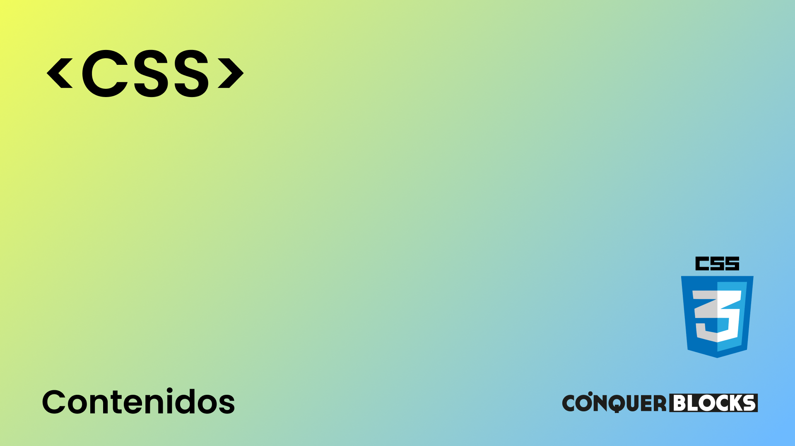

<h1>Máster en Desarrollo FullStack y Blockchain de ConquerBlocks</h1>

<h2>Repositorio creado para el módulo de CSS para Máster de Desarrollo FullStack y Blockchain de ConquerBlocks</h2>

<h4>Material de las clases</h4>
<ul>
    <li><a target="_blank" href="https://github.com/bienvenidosaez/conquerblocks-css/blob/master/00_indice_modulo/CSS%20-%20Contenidos.pdf">Índice de contenidos del módulo</a></li>
    <li><a target="_blank" href="https://github.com/bienvenidosaez/conquerblocks-css/blob/master/01_clases/Clase%2000%20-%20Presentaci%C3%B3n/CSS%20Clase%2001%20-%20Introducci%C3%B3n%20a%20CSS.pdf">CSS Clase 01 - Introducción a CSS</a></li>
    <li><a target="_blank" href="https://github.com/bienvenidosaez/conquerblocks-css/blob/master/01_clases/Clase%2002%20-%20Unidades%20de%20medida%20en%20CSS/CSS%20Clase%2002%20-%20Unidades%20de%20medida.pdf">CSS Clase 02 - Unidades de medida</a></li>
    <li><a target="_blank" href="https://github.com/bienvenidosaez/conquerblocks-css/blob/master/01_clases/Clase%2003%20-%20Tipos%20de%20etiqueta%20y%20CSS%20del%20navegador/CSS%20Clase%2003%20-%20Tipos%20de%20etiqueta%20y%20CSS%20del%20navegador%20(Diapositivas).pdf">CSS Clase 03 - Tipos de etiqueta y CSS del navegador</a></li>
    <li><a target="_blank" href="https://github.com/bienvenidosaez/conquerblocks-css/blob/master/01_clases/Clase%2004%20-%20Cascada%20y%20prioridad/CSS%20Clase%2004%20-%20Cascada%20y%20especificaci%C3%B3n.pdf">CSS Clase 04 - Cascada y prioridad</a></li>
    <li><a target="_blank" href="https://github.com/bienvenidosaez/conquerblocks-css/blob/master/01_clases/Clase%2005%20-%20Selectores%20I/CSS%20Clase%2005%20-%20Selectores%20I.pdf">CSS Clase 05 - Selectores I</a></li>
    <li><a target="_blank" href="https://github.com/bienvenidosaez/conquerblocks-css/blob/master/01_clases/Clase%2006%20-%20Selectores%20II/CSS%20Clase%2006%20-%20Selectores%20II.pdf">CSS Clase 06 - Selectores II</a></li>
    <li><a target="_blank" href="https://github.com/bienvenidosaez/conquerblocks-css/blob/master/01_clases/Clase%2007%20-%20Selectores%20III/CSS%20Clase%2007%20-%20Selectores%20III.pdf">CSS Clase 07 - Selectores III</a></li>
    <li><a target="_blank" href="https://github.com/bienvenidosaez/conquerblocks-css/blob/master/01_clases/Clase%2008%20-%20Selectores%20IV/CSS%20Clase%2008%20-%20Selectores%20IV.pdf">CSS Clase 08 - Selectores IV</a></li>
    <li><a target="_blank" href="https://github.com/bienvenidosaez/conquerblocks-css/blob/master/01_clases/Clase%2009%20-%20Resoluci%C3%B3n%20de%20ejercicios%20de%20Selectores/CSS%20Clase%2009%20-%20Ejercicios%20de%20Selectores%20resueltos.pdf">CSS Clase 09 - Resolución de ejercicios de Selectores</a></li>
    <li><a target="_blank" href="https://github.com/bienvenidosaez/conquerblocks-css/blob/master/01_clases/Clase%2010%20-%20Texto%20en%20CSS/CSS%20Clase%2010%20-%20Texto%20en%20CSS.pdf">CSS Clase 10 - Texto en CSS</a></li>
    <li><a target="_blank" href="https://github.com/bienvenidosaez/conquerblocks-css/blob/master/01_clases/Clase%2011%20-%20Texto%20en%20CSS%202/CSS%20Clase%2011%20-%20Texto%20en%20CSS%202.pdf">CSS Clase 11 - Texto en CSS II</a></li>
    <li><a target="_blank" href="https://github.com/bienvenidosaez/conquerblocks-css/blob/master/01_clases/Clase%2011%20-%20Texto%20en%20CSS%202/CSS%20Clase%2011%20-%20Texto%20en%20CSS%202.pdf">CSS Clase 11 - Texto en CSS II</a></li>
    <li><a target="_blank" href="https://github.com/bienvenidosaez/conquerblocks-css/blob/master/01_clases/Clase%2012%20-%20Tipograf%C3%ADas%20en%20CSS/CSS%20Clase%2012%20-%20Tipograf%C3%ADas%20en%20CSS.pdf">CSS Clase 12 - Tipografías en CSS</a></li>
    <li><a target="_blank" href="https://github.com/bienvenidosaez/conquerblocks-css/blob/master/01_clases/Clase%2013%20-%20Iconos%20tipogr%C3%A1ficos/CSS%20Clase%2013%20-%20Iconos%20tipogr%C3%A1ficos.pdf">CSS Clase 13 - Iconos tipográficos</a></li>
    <li><a target="_blank" href="https://github.com/bienvenidosaez/conquerblocks-css/blob/master/01_clases/Clase%2013.1%20-%20Ejercicio%20Icomoon/CSS%20Clase%2013.1%20Ejercicio%20tipograf%C3%ADa%20en%20Icomoon.pdf">CSS Clase 13.1 - Resolución de ejercicio Icomoon</a></li>
    <li><a target="_blank" href="https://github.com/bienvenidosaez/conquerblocks-css/blob/master/01_clases/Clase%2014%20-%20Modelo%20de%20cajas/CSS%20Clase%2014%20-%20Modelo%20de%20cajas.pdf">CSS Clase 14 - Modelo de caja</a></li>
    <li><a target="_blank" href="https://github.com/bienvenidosaez/conquerblocks-css/blob/master/01_clases/Clase%2014.1%20-%20Ejercicio%20modelo%20de%20cajas/CSS%20Clase%2014.1%20Ejercicios%20de%20modelo%20de%20caja.pdf">CSS Clase 14.1 - Ejercicios del modelo de caja</a></li>
    <li><a target="_blank" href="https://github.com/bienvenidosaez/conquerblocks-css/blob/master/01_clases/Clase%2015%20-%20Manejo%20de%20Im%C3%A1genes%20en%20CSS/CSS%20Clase%2015%20Manejo%20de%20im%C3%A1genes%20en%20CSS.pdf">CSS Clase 15 - Manipulación de imágenes en CSS I</a></li>
    <li><a target="_blank" href="https://github.com/bienvenidosaez/conquerblocks-css/blob/master/01_clases/Clase%2016%20-%20Manejo%20de%20Im%C3%A1genes%20en%20CSS%20II/CSS%20Clase%2016%20Manejo%20de%20im%C3%A1genes%20en%20CSS%20II.pdf">CSS Clase 16 - Manipulación de imágenes en CSS II</a></li>
    <li><a target="_blank" href="https://github.com/bienvenidosaez/conquerblocks-css/blob/master/01_clases/Clase%2016.1%20-%20Ejercicios%20de%20manejo%20de%20im%C3%A1genes/CSS%20Clase%2016.1%20-%20Ejercicios%20de%20manejo%20de%20im%C3%A1genes%20en%20CSS.pdf">CSS Clase 16.1 - Ejercicios de manejo de imágenes de fondo</a></li>
    <li><a target="_blank" href="https://github.com/bienvenidosaez/conquerblocks-css/blob/master/01_clases/Clase%2017%20-%20Posicionamiento%20I/CSS%20Clase%2017%20-%20Posicionamiento%20I.pdf">CSS Clase 17 - Posicionamiento I</a></li>
    <li><a target="_blank" href="https://github.com/bienvenidosaez/conquerblocks-css/blob/master/01_clases/Clase%2018%20-%20Posicionamiento%20II/CSS%20Clase%2018%20-%20Posicionamiento%20II.pdf">CSS Clase 18 - Posicionamiento II</a></li>
    <li><a target="_blank" href="https://github.com/bienvenidosaez/conquerblocks-css/blob/master/01_clases/Clase%2019%20-%20Ejercicios%20posicionamiento%20b%C3%A1sico/CSS%20Clase%2019%20-%20Ejercicios%20de%20posicionamiento%20b%C3%A1sico.pdf">CSS Clase 19 - Ejercicios de Posicionamiento básico</a></li>
    <li><a target="_blank" href="https://github.com/bienvenidosaez/conquerblocks-css/blob/master/01_clases/Clase%2020%20-%20Flexbox/CSS%20Clase%2020%20-%20Flexbox.pdf">CSS Clase 20 - Flexbox</a></li>
    <li><a target="_blank" href="https://github.com/bienvenidosaez/conquerblocks-css/blob/master/01_clases/Clase%2021%20-%20Ejercicios%20Flexbox%201/CSS%20Clase%2021%20-%20Ejercicios%20posicionamiento%20Flexbox%201.pdf">CSS Clase 21 - Ejercicios de posicionamiento Flexbox 1</a></li>
    <li><a target="_blank" href="https://github.com/bienvenidosaez/conquerblocks-css/blob/master/01_clases/Clase%2022%20-%20Ejercicios%20Flexbox%202/CSS%20Clase%2022%20-%20Ejercicios%20posicionamiento%20Flexbox%202.pdf">CSS Clase 22 - Ejercicios de posicionamiento Flexbox 2</a></li>
    <li><a target="_blank" href="https://github.com/bienvenidosaez/conquerblocks-css/blob/master/01_clases/Clase%2022.1%20-%20Resoluci%C3%B3n%20ejercicios%20de%20posicionamiento%20Flexbox%202/CSS%20Clase%2022.1%20-%20Ejercicios%20posicionamiento%20Flexbox%202.pdf">CSS Clase 22.1 - Resolución de posicionamiento Flexbox 2</a></li>
    <li><a target="_blank" href="https://github.com/bienvenidosaez/conquerblocks-css/blob/master/01_clases/Clase%2023%20-%20Posicionamiento%20Grid%20Parte%201/CSS%20Clase%2023%20-%20Posicionamiento%20Grid%20Cap%C3%ADtulo%201.pdf">CSS Clase 23 - Clase 23 - Posicionamiento Grid Parte 1</a></li>
    <li><a target="_blank" href="https://github.com/bienvenidosaez/conquerblocks-css/blob/master/01_clases/Clase%2024%20-%20Posicionamiento%20Grid%20Parte%202/CSS%20Clase%2024%20-%20Posicionamiento%20Grid%20Cap%C3%ADtulo%202.pdf">CSS Clase 24 - Posicionamiento Grid Parte 2</a></li>
    <li><a target="_blank" href="https://github.com/bienvenidosaez/conquerblocks-css/blob/master/01_clases/Clase%2025%20-%20Ejercicios%20de%20posicionamiento%20Grid%20-%20Relaci%C3%B3n%201/CSS%20clase%2025%20-%20Ejercicios%20de%20posicionamiento%20GRID%20-%20Relaci%C3%B3n%201.pdf">CSS Clase 25 - Ejercicios de posicionamiento Grid - Relación 1</a></li>
    <li><a target="_blank" href="https://github.com/bienvenidosaez/conquerblocks-css/blob/master/01_clases/Clase%2026%20-%20Ejercicios%20de%20posicionamiento%20Grid%20-%20Relaci%C3%B3n%202/Clase%2026%20-%20Ejercicios%20de%20posicionamiento%20Grid%20-%20Relaci%C3%B3n%202.pdf">CSS Clase 26 - Ejercicios de posicionamiento Grid - Relación 2</a></li>
    <li><a target="_blank" href="https://github.com/bienvenidosaez/conquerblocks-css/blob/master/01_clases/Clase%2026a%20-%20Ejercicios%20de%20posicionamiento%20Grid%20-%20Relaci%C3%B3n%202%20-%20Ejercicio%201/CSS%20Clase%2026a%20-%20Ejercicio%20posicionamiento%20Grid%20-%20Relaci%C3%B3n%202%20-%20Ejercicio%201.pdf">Clase 26a - Ejercicios de posicionamiento Grid - Relación 2 - Ejercicio 1</a></li>
    <li><a target="_blank" href="https://github.com/bienvenidosaez/conquerblocks-css/blob/master/01_clases/Clase%2026b%20-%20Ejercicios%20de%20posicionamiento%20Grid%20-%20Relaci%C3%B3n%202%20-%20Ejercicio%202/CSS%20Clase%2026b%20-%20Ejercicio%20posicionamiento%20Grid%20-%20Relaci%C3%B3n%202%20-%20Ejercicio%202.pdf">Clase 26b - Ejercicios de posicionamiento Grid - Relación 2 - Ejercicio 2</a></li>
</ul>
